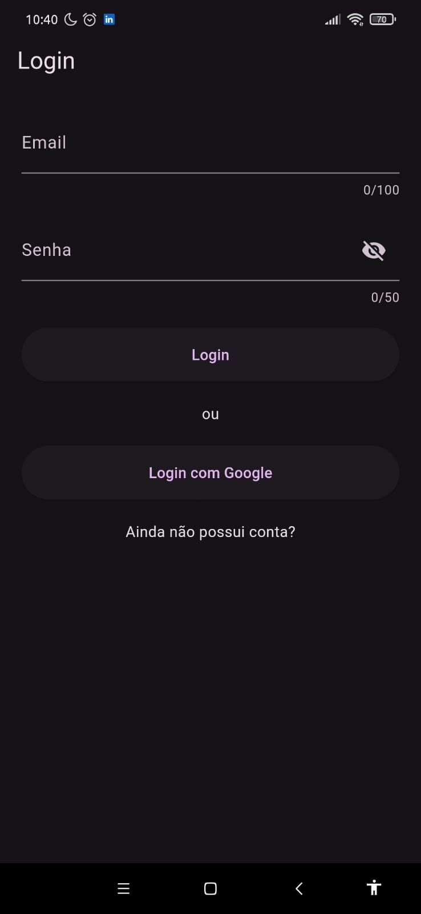
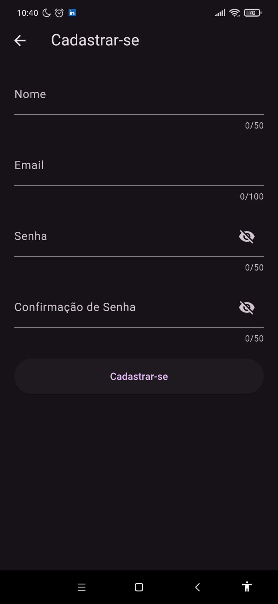
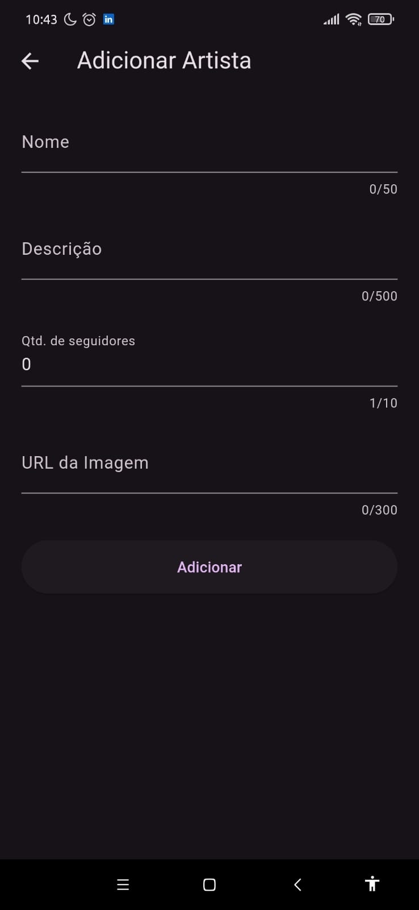
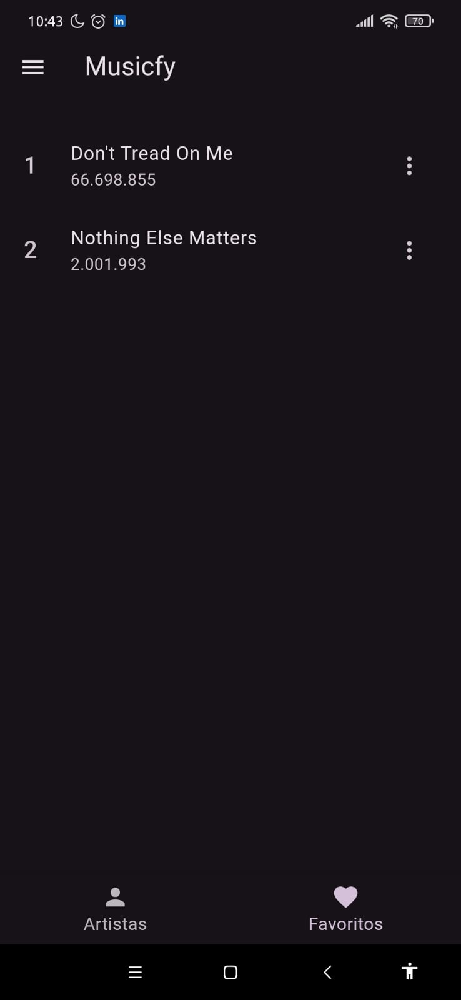
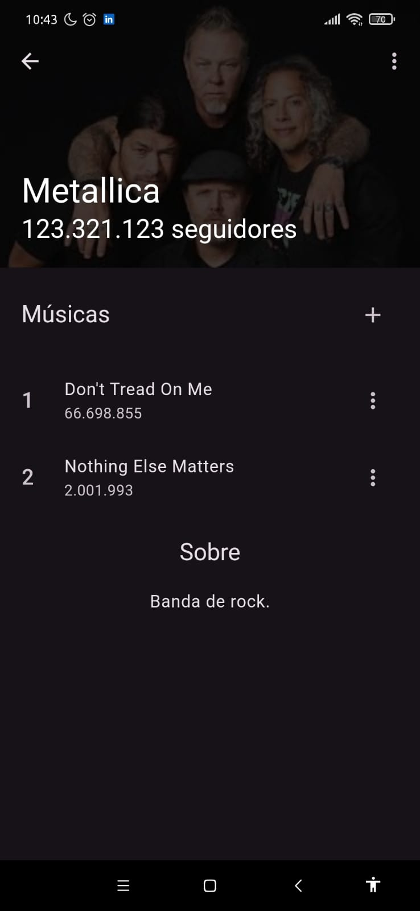
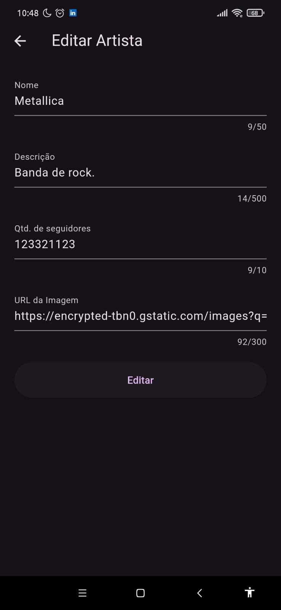
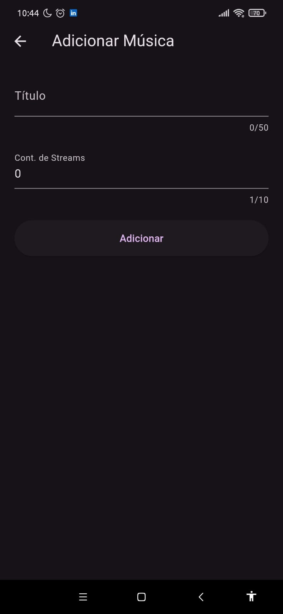

# Musicfy

A música que você busca, no lugar que você está.

## Requisitos

### Requisitos mínimos:

- [ ]  Os dados da aplicação deverão estar salvos em um banco de dados acessível através da internet: preferencialmente uma tecnologia consolidada no mercado de aplicações móveis. Considere o padrão CRUD como requisito mínimo.
- [ ]  O aplicativo deve implementar recursos para garantir que as requisições ao banco de dados não interropam o fluxo do programa;
- [ ]  A aplicação deve implementar formas de reduzir a quantidade de requisições ao servidor de dados, priorizando transações locais sempre que possível;
- [ ]  O envio de dados ao DB deve ser validado para não acontecerem incoerências de tipo, estrutura, formato, etc.
- [ ]  A aplicação deve tratar os erros de forma consistente e eficiente. Exibindo as principais mensagens de erro e evitando comportamentos estranhos na aplicação.
- [ ]  A aplicação deve implementar pelo menos duas formas de controle de estado relevantes ao funcionamento do aplicativo. *Sugestões: lista de favoritos, controle de navegação, controle de usuário(só faz sentido implementando perfis de usuário), configurações da aplicação, manter dados em formulários, validar dados em tempo real, histórico de navegação do usuário.*
- [ ]  A aplicação deve implementar um mecanismo de login e controle do usuário.

### Requisitos extras:

Para cada requisito extra implementado, um requisito minimo poderá ser desconsiderado na avaliação.

- [ ]  Implementar alguma forma de notificação através do sistema sobre eventos importantes. As notificações não devem depender de interações do usuário, mas de eventos que são disparados por outros contextos.
- [ ]  Implementar uma forma de login, informações e controle de usuário com alguma API de terceiros. *Por exemplo: Google, Facebook, Apple, etc.*

## Demonstração das Telas

### Tela Login

  

### Tela Cadastro

  

### Tela Artistas

  

### Tela Adicionar Artista

  

### Tela Favoritos

  

### Tela Detalhes Artista

  

### Tela Editar Artista

  

### Tela Adicionar Musica

  

### Tela Editar Musica

  

### Drawer

  

### Tela Sobre

  

## Componentes

- Jonathan Araujo Paiva
- Patrine Silva Santos
