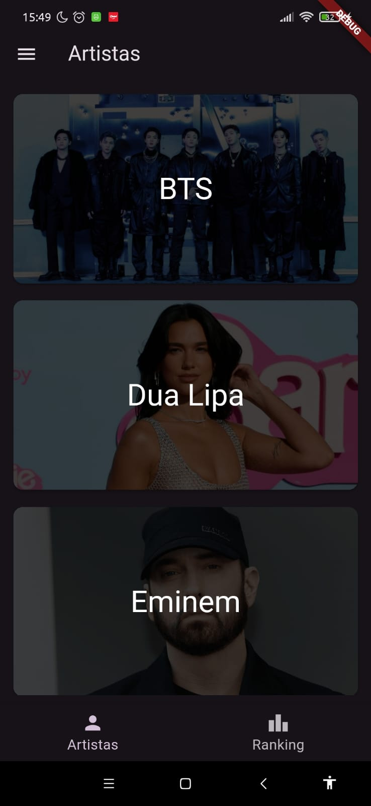
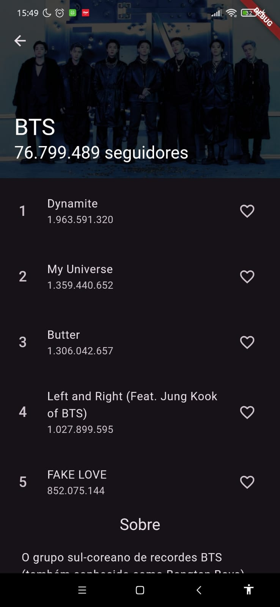
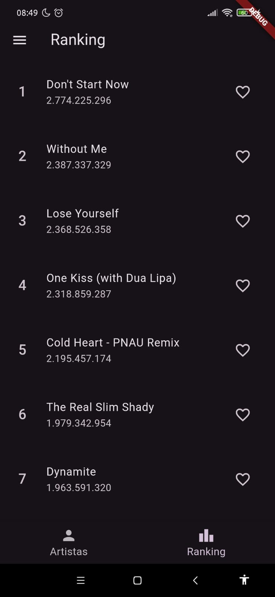

# Musicfy

A música que você busca, no lugar que você está.

## Requisitos

1. A aplicação deve ter uma tela inicial com uma AppBar para exibição de algum texto relativo ao seu aplicativo.
2. A tela inicial deve conter uma BottomNavigationBar com pelo menos duas abas identificadas por ícones. Cada aba deve levar o usuário a telas com informações e/ou funções diferentes.
3. Além da tela inicial, o aplicativo deve implementar uma tela secundária que modifica o seu conteúdo dependendo da escolha que o usuário fizer em uma das telas iniciais. Essa tela secundária deve conter uma AppBar com o botão de retorno à tela inicial.
4. Em alguma tela é necessário exibir widgets semelhantes organizados de forma estruturada e que utilizam dados salvos em um arquivo para a exibição de informações ou definição de propriedades do próprio widget (ex. cor).
5. A aplicação deve implementar um SideDrawer que deve implementar uma opção que leva o usuário para uma tela onde são exibidas as informações sobre os membros do grupo e a aplicação. Caso necessário, o SideDrawer pode ser usado para navegar para outros telas.
6. A navegação entre as telas deve ser feita utilizando o Navigator 1.0 disponível no Flutter.
7. Os dados a serem utilizados na aplicação devem estar disponíveis em um arquivo. Todos os dados relevantes devem ser representados através de objetos na aplicação.
8. Não é aceitável utilizar qualquer widget ou recurso que não seja nativo do Flutter.
9. É necessário estruturar o código como: feature first ou layer first.
10. Estruture o código e os elementos de interface buscando otimizar o reaproveitamento de widgets e código.

## Demonstração das Telas

### Artistas

  

### Detalhes Artista

  

### Ranking

  

### Sobre

  

## Componentes

- Jonathan Araujo Paiva
- Patrine Silva Santos
